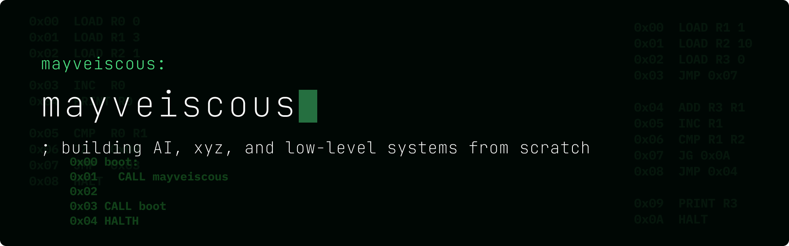
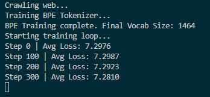

  

## Who Am I

I'm 17 and have been programming since my 12th birthday! I started with Roblox game development (and still occasionally go back to it), but quickly became interested in pyhsics simulations, systems programming, and AI\ML.

### Currently Focused On

* Large Language Models
* ML Infrastructure
* Systems Programming

### Current Goals

* Improve my understanding of ML infrastructure.
* Contribute to the development of **safe** and **ethical** AI systems.
* Continue developing my LLM, orienting it toward professional capabilities in Tunascript.
* Build more projects in Python, Lua, and C++, and upload older projects to GitHub.
* Learn more about high-performance computing and large-scale AI systems.

### Interests

* Machine Learning Infrastructure
* Artificial Intelligence
* Language Development
* AI Systems in Game Development

---

## Featured Projects

### [LLM *(Work in Progress)*](https://github.com/mayveiscous/basic-llm)

A transformer-based language model built entirely from scratch in Go, including a custom tensor library, basic BPE tokenizer, automatic differentiation, and training pipeline.

This project is where I'm learning the mathematics and engineering behind modern AI systems. I plan on open-sourcing the tensor library (and maybe the tokenizer!) for others who are curious about machine learning in Go.

---

### [Tunascript](https://github.com/mayveiscous/tunascript)

I'm the creator of **Tunascript**, a Lua-inspired programming language written in Go featuring a Pratt parser, tree-walk interpreter, and built entirely using the Go standard library.

I initially started this project to learn Go's unique syntax, but quickly got hooked on language development and decided to take Tunascript to the next level.

It has grown into a capable scripting language with an extensive standard library, objects, modules, and more. *(You should totally check it out!)*

I also developed a **Language Server Protocol (LSP)** implementation for Tunascript. Unfortunately, recent computer issues resulted in losing the project before it had been backed up to GitHub.

---

### [CPU Emulator](https://github.com/mayveiscous/tuna-processing-unit)

An 8-bit virtual machine and assembler written in Go. It includes a custom instruction set, registers, memory model, stack operations, commands, and execution pipeline.

This project may very well be my favourite. It also contains some of the cleanest and most modular code I've written.

## Tech Stack

### Languages
* Go
* Lua
* Python
* C++
* JavaScript

### AI & Machine Learning

* Transformer Models
* Automatic Differentiation
* Tokenization
* Gradient Descent

### Systems

* Virtual Machines
* Emulation
* Language Server Protocol (LSP)
* Language Interpretation
* Parsing
* Physics Simulations

### Tools & Technologies

* Git
* GitHub
* JSON
* HTML5
* CSS
* REST APIs
* HTTP
* TCP/IP

---

I'm heavily inspired by *Anthropic's* engineering culture and approach to building **Helpful**, **Harmless**, and **Honest** AI.
